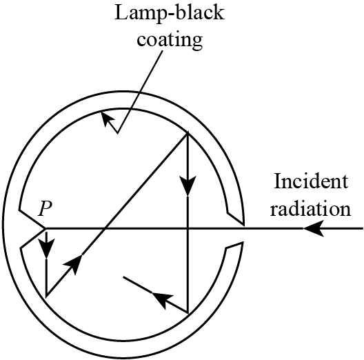
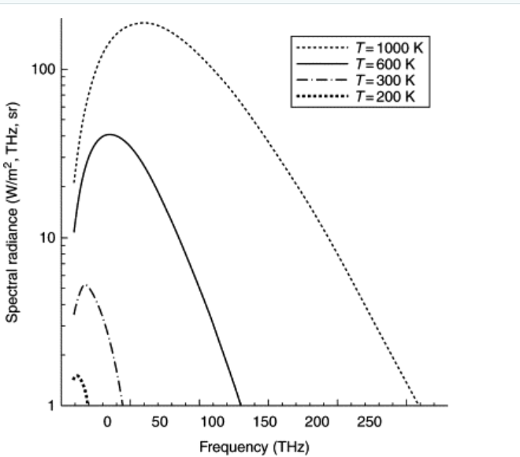

# **Introduction**

Essentially, all of chemistry is a consequence of the laws of quantum
mechanics. If chemistry is to be understood at the fundamental level of
electrons, atoms, and molecules, quantum mechanics must be incorporated
and internalized. Quantities such as the heat of combustion of octane,
25 °C, the entropy of liquid water, the reaction rate of $N_2$ and $H_2$
gases under specified conditions, the equilibrium constants of chemical
reactions, the absorption spectra of coordination compounds, the NMR
spectra of organic compounds, the nature of the products when organic
compounds react, the shape into which a protein molecule will fold when
it is formed in a cell, the structure and function of DNA are all a
consequence of quantum mechanics.

In 1929, Dirac, one of the founders of quantum mechanics, wrote that
\"The general theory of quantum mechanics is now almost complete\...the
underlying physical laws necessary for the mathematical theory of\...the
whole of chemistry are thus completely known, and the difficulty is only
that the exact applications of these laws lead to equations much too
complicated to be soluble.\"

After its discovery, quantum mechanics was used to develop many concepts
that helped explain chemical properties. However, because of the highly
difficult calculations needed to apply quantum mechanics to chemical
systems, it was of little practical value in accurately calculating the
properties of chemical systems for many years after its discovery.
Nowadays, the extraordinary power of modern computation allows
quantum-mechanical calculations to give accurate chemical predictions in
many systems of real chemical interest.

## **Wave vs Particle**

Two fundamental properties of waves are **Interference** and
**Diffraction**\
whereas particles follow **Newton's Equation of Motion**.

**Scalar Wave Equation:**

$$\begin{equation}
    \frac{\partial^2 E}{\partial t^2} = c^2 \frac{\partial^2 E}{\partial t^2}
\end{equation}$$ (1) is applicable to an electromagnetic wave.

For an elementary wave, the change of change of anything with respect to
time is proportional to the change of change of anything with respect to
space.

$$\begin{equation}
    E = A \sin\left(\frac{2 \pi x}{\lambda} - 2 \pi \nu t\right)
\end{equation}$$ let $\frac{2 \pi }{\lambda} = k$ and
${2 \pi \nu} = \omega$. Then, E = A sin(kx-$\omega$t)

Now, we calculate the second time derivative of (2) $$\begin{align}
    \frac{\partial E}{\partial t} &= -\omega A \cos(kx - \omega t) \\
    \frac{\partial^2 E}{\partial t^2} &= -\omega^2 A \sin(kx - \omega t)
\end{align}$$

Similarly, calculating the second spatial derivative of (2)
$$\begin{align}
    \frac{\partial E}{\partial x} &= k A \cos(kx - \omega t) \\
    \frac{\partial^2 E}{\partial x^2} &= -k^2 A \sin(kx - \omega t)
\end{align}$$

Substituting Equation (4) and Equation (6) back into the wave equation
(1) yields: $$\begin{equation}
    -\omega^2 A \sin(kx - \omega t) = c^2 \left( -k^2 A \sin(kx - \omega t) \right)
\end{equation}$$

Dividing both sides by $-A \sin(kx - \omega t)$ simplifies the
expression to: $$\begin{equation}
    \omega^2 = c^2 k^2
\end{equation}$$

Taking the positive square root of both sides gives: $$\begin{equation}
 \omega = ck
\end{equation}$$

Again, as shown previously, $$\begin{equation}
    \omega = 2\pi\nu, k = \frac{2\pi}{\lambda}
\end{equation}$$

Substituting these two relations into (9); $$\begin{equation}
    2\pi\nu = c \left( \frac{2\pi}{\lambda} \right)
\end{equation}$$

Dividing both sides by $2\pi$ simplifies the equation to:
$$\begin{equation}
    \nu = \frac{c}{\lambda}
\end{equation}$$

Multiplying both sides by $\lambda$ gives the final relationship:
$$\begin{equation}
    c = \lambda\nu
\end{equation}$$

Hence proved.

# **Limitations of Classical Physics**

- **The Dawn of a Crisis**: At the turn of the twentieth century, the
  reliable frameworks of Newtonian mechanics and Maxwellian
  electrodynamics suddenly collapsed when applied to the atomic scale.

- **A Radical Leap**: This breakdown forced physicists to abandon the
  assumption of continuous energy, replacing it with the groundbreaking
  concept of discrete energy packets known as \"quanta.\"

- **The Empirical Trigger**: This was not just a theoretical debate; it
  was driven by stark anomalies in the lab that classical physics simply
  could not reconcile.

- **The Quantum Turning Point**: These systemic failures exposed the
  hard boundaries of the old world, leading to a series of historic
  experiments that birthed modern quantum mechanics.

This theoretical collapse was forced by an unavoidable reality:
experimental data flatly contradicted classical predictions. Laboratory
anomalies transformed from minor quirks into insurmountable roadblocks
for traditional physics, challenging long-held assumptions about light,
matter, and atomic structure. The most devastating blows came from a
handful of targeted investigations---specifically, the riddle of
black-body radiation, the confounding mechanics of the photoelectric
effect, and the unexplained line spectra of the hydrogen atom. Each of
these pivotal experiments systematically exposed the limits of classical
intuition, leaving physics with no choice but to rebuild its
foundational rules from the ground up.

# **Experiments that Classical Physics could not explain** 

1.  Blackbody Radiation

2.  Photoelectric effect

3.  Compton Scattering

4.  Stability of atoms and Atomic Spectra

5.  Heat Capacity of solids

6.  Pair Creation and Pair Annihilation

## **Blackbody Radiation**

When a solid is heated, it emits light. Classical physics pictures light
as a wave consisting of oscillating electric and magnetic fields, an
electromagnetic wave. The frequency $\nu$ and wavelength $\lambda$ of an
electromagnetic wave traveling through vacuum are related by

$$\begin{align}
    \lambda \nu &= c
\end{align}$$

where $c = 3.0 \times 10^8 \text{ m/s}$ is the speed of light in vacuum.
While human vision is sensitive to frequencies between
$4 \times 10^{14}$ and $7 \times 10^{14}$ Hz, electromagnetic radiation
covers a broader spectrum. The term \"light\" is used here to refer to
all electromagnetic radiation, not just visible light.

**Thermal Radiation:** Any body in our universe at finite temperature
emits radiation in practically all frequencies.

**Definition of a Blackbody:** A body that absorbs all the radiation
incident upon it and emits radiation in all the frequencies.

**Definition of Spectral Radiancy:** Total energy emitted per unit
volume per unit time in the frequency range $\nu$ to $\nu$ + d$\nu$

or

Total energy emitted per unit cross-sectional area per unit time in the
frequency range $\nu$ to $\nu$ + d$\nu$

<figure id="fig:1.0" data-latex-placement="h">

<figcaption>A cavity acting as a blackbody</figcaption>
</figure>

**Wien's Displacement Law:** The wavelength at which a blackbody
radiates maximum intensity is inversely proportional to its absolute
temperature. The law is expressed mathematically as:

$$\begin{align}
    \lambda _{max}=\frac{b}{T}\
\end{align}$$

Wien's constant, b = 2.9 × 10^−3^ mK

**Stefan's Law:** The total thermal radiation power emitted by an object
is directly proportional to its surface area and the fourth power of its
absolute temperature. For an ideal black body, the total radiancy R is
calculated as:

$$\begin{equation}
    R = \sigma A T^4
\end{equation}$$

Stefan-Boltzmann constant, $\sigma$ = 5.670 × 10^−8^ W m^2^ K^−−4^

### **Rayleigh-Jean's Theory**

- The internal walls of the black body behave like simple harmonic
  oscillators.

- Each vibrating motion is associated with a standing wave of radiation
  within a black body.

- There can be an infinite number of standing waves of all wavelengths
  within the black body cavity (blackbody can absorb radiation of any
  frequency), hence, at a given temperature, the number of standing
  waves within a wavelength range $\lambda$ to $\lambda + d\lambda$
  depends on the temperature.

- At any given instant, the amount of waves of diff$^n$ $\lambda$ coming
  out of the black body is proportional to the amount of standing waves
  of different $^n$ $\lambda$ within the cavity.

<figure id="fig:placeholder" data-latex-placement="h">

<figcaption>Spectral Radiancy (R) vs Frequency <em>ν</em></figcaption>
</figure>

{#fig:placeholder width="50%"}
